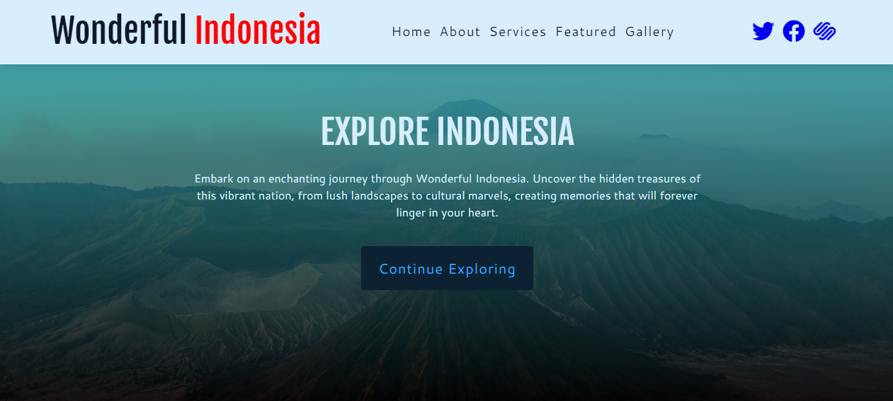

# Wonderful Indonesia Landing Page

Welcome to the "Wonderful Indonesia" project, a landing page dedicated to showcasing the beauty of Indonesia. Explore the diverse culture, natural wonders, and vibrant landscapes that make Indonesia a must-visit destination.



## Table of Contents
- [Demo](#demo)
- [Description](#description)
- [Features](#features)
- [Usage](#usage)
- [Contributing](#contributing)

## Demo

Visit the live demo: [Wonderful Indonesia](https://wonderful-id.netlify.app)

## Description

The "Wonderful Indonesia" landing page is designed to provide a visual journey through the captivating beauty of Indonesia. It features various sections to engage and inform visitors about the country's unique offerings.

## Features

- **Navbar:** A navigation bar to easily access different sections of the landing page.
- **Hero Section:** An attractive hero section with stunning images and a welcoming message.
- **About Section:** Information about Indonesia's culture, history, and natural wonders.
- **Services Section:** Details about the services and experiences available.
- **Featured Tours:** Showcase of popular and recommended tours.
- **Contact Section:** Contact information and a form to get in touch.
- **Gallery:** A captivating gallery of images capturing Indonesia's beauty.
- **Footer:** Footer section with relevant links and social media icons.

## Usage

1. Clone the repository:

   ```bash
   git clone https://github.com/yuliussetyawan/wonderful-indonesia.git

2. Open index.html in your web browser to view    the landing page locally.
Feel free to customize and enhance the landing page to suit your project's needs.


## Contributing

Contributions are welcome! If you'd like to contribute to this project, please follow these guidelines:

1. Fork the repository
2. Create a new branch
3. Make your changes
4. Submit a pull request